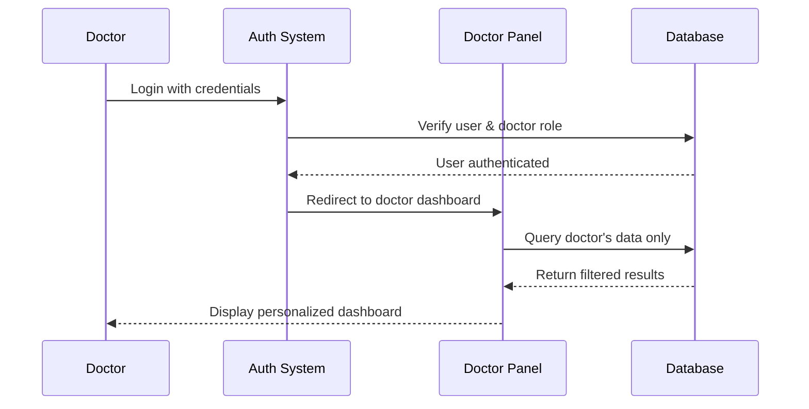

# Doctor Dashboard Design Document

## Overview

The Doctor Dashboard is a specialized Filament-based interface that provides doctors with comprehensive tools to manage their appointments, view bookings, and handle both online and clinic-based consultations. This dashboard integrates seamlessly with the existing WellClinic Laravel/Filament architecture while providing role-based access control to ensure doctors can only access their own data.

The dashboard leverages the existing models (Doctor, Slot, Booking) and extends the current Filament admin panel with doctor-specific functionality. It supports both Arabic and English languages with RTL layout support and provides real-time updates for appointment management.

### Key Features

- **Appointment Management**: Create, edit, and delete appointment slots with support for both online (Zoom) and clinic appointments
- **Booking Overview**: View and manage patient bookings with detailed information and quick actions
- **Calendar Integration**: Visual calendar interface for appointment scheduling and management
- **Zoom Integration**: Automatic Zoom meeting creation for online appointments with meeting links
- **Multi-language Support**: Full Arabic and English support with RTL layout
- **Role-based Security**: Doctors can only access their own appointments and data
- **Real-time Updates**: Live updates for booking status changes and new appointments

## Architecture

### System Integration

The Doctor Dashboard extends the existing Filament admin panel architecture by creating a separate panel specifically for doctors. This approach maintains separation of concerns while leveraging Filament's powerful features.

```
┌─────────────────────────────────────────────────────────────┐
│                    WellClinic Application                    │
├─────────────────────────────────────────────────────────────┤
│  Existing Admin Panel          │  New Doctor Dashboard      │
│  (/admin)                      │  (/doctor)                 │
│  - Full system access          │  - Doctor-specific access  │
│  - All resources               │  - Own appointments only   │
│  - System management           │  - Booking management      │
└─────────────────────────────────────────────────────────────┘
│                    Shared Infrastructure                     │
│  - Laravel Authentication      - Filament Framework         │
│  - Eloquent Models             - ZoomService                │
│  - Database Layer              - Localization               │
└─────────────────────────────────────────────────────────────┘
```

### Panel Architecture

The doctor dashboard will be implemented as a separate Filament panel with its own:

- **Panel Provider**: `DoctorPanelProvider` for configuration
- **Resources**: Doctor-specific resources with filtered data
- **Widgets**: Dashboard widgets showing doctor's statistics
- **Pages**: Custom pages for appointment management
- **Middleware**: Authentication and authorization for doctor role

### Authentication Flow



## Components and Interfaces

### Core Components

#### 1. Doctor Panel Provider
**Location**: `app/Providers/Filament/DoctorPanelProvider.php`

Configures the doctor-specific Filament panel with:
- Custom path (`/doctor`)
- Doctor role authentication
- Localization support
- Custom theme and branding

#### 2. Doctor Dashboard Resource
**Location**: `app/Filament/Doctor/Resources/AppointmentResource.php`

Manages appointment slots with:
- CRUD operations for slots
- Appointment type selection (online/clinic)
- Bulk slot creation
- Calendar view integration

#### 3. Booking Management Resource
**Location**: `app/Filament/Doctor/Resources/BookingResource.php`

Handles patient bookings with:
- Read-only booking information
- Patient contact details
- Zoom meeting links
- Booking status updates

#### 4. Dashboard Widgets

**Stats Overview Widget**
- Total appointments (today, week, month)
- Booking statistics
- Revenue metrics
- Patient count

**Upcoming Appointments Widget**
- Next 5 appointments
- Quick actions (start Zoom, reschedule)
- Patient information preview

**Calendar Widget**
- Monthly calendar view
- Appointment density visualization
- Quick slot creation

#### 5. Slot Management Service
**Location**: `app/Services/DoctorSlotService.php`

Business logic for:
- Slot creation and validation
- Overlap detection
- Bulk operations
- Zoom meeting integration

### Interface Specifications

#### Appointment Creation Interface

```php
// Form schema for appointment creation
Forms\Components\Grid::make(2)
    ->schema([
        Forms\Components\Select::make('type')
            ->options([
                'online' => __('Online Consultation'),
                'clinic' => __('Clinic Visit')
            ])
            ->required()
            ->reactive(),
            
        Forms\Components\DatePicker::make('date')
            ->required()
            ->minDate(now())
            ->maxDate(now()->addMonths(3)),
            
        Forms\Components\TimePicker::make('start_time')
            ->required()
            ->seconds(false),
            
        Forms\Components\TimePicker::make('end_time')
            ->required()
            ->seconds(false)
            ->after('start_time'),
            
        Forms\Components\Textarea::make('notes')
            ->visible(fn ($get) => $get('type') === 'clinic')
            ->label(__('Clinic Instructions')),
    ])
```

#### Booking Display Interface

```php
// Table columns for booking management
Tables\Columns\TextColumn::make('appointment_at')
    ->label(__('Appointment Time'))
    ->dateTime('M j, Y g:i A')
    ->sortable(),
    
Tables\Columns\TextColumn::make('patient_name')
    ->label(__('Patient'))
    ->searchable(),
    
Tables\Columns\BadgeColumn::make('status')
    ->colors([
        'warning' => 'pending',
        'success' => 'confirmed',
        'info' => 'completed',
        'danger' => 'cancelled',
    ]),
    
Tables\Columns\IconColumn::make('zoom_meeting_id')
    ->label(__('Type'))
    ->boolean()
    ->trueIcon('heroicon-o-video-camera')
    ->falseIcon('heroicon-o-building-office'),
```

## Data Models

### Extended Slot Model

The existing Slot model will be extended with additional fields and methods:

```php
// Additional fields for appointment types
protected $fillable = [
    'doctor_id',
    'date',
    'start_time', 
    'end_time',
    'status',
    'type',           // 'online' or 'clinic'
    'notes',          // Clinic-specific instructions
    'zoom_meeting_id', // For online appointments
    'zoom_join_url',
    'zoom_start_url',
];

// New methods
public function isOnline(): bool
{
    return $this->type === 'online';
}

public function isClinic(): bool  
{
    return $this->type === 'clinic';
}

public function hasZoomMeeting(): bool
{
    return !empty($this->zoom_meeting_id);
}
```

### Doctor Dashboard Statistics

New computed properties for dashboard metrics:

```php
// In Doctor model
public function getTodayAppointmentsCount(): int
{
    return $this->slots()
        ->whereDate('date', today())
        ->where('status', 'booked')
        ->count();
}

public function getUpcomingAppointmentsCount(): int
{
    return $this->slots()
        ->where('date', '>=', today())
        ->where('status', 'booked')
        ->count();
}

public function getMonthlyRevenue(): float
{
    return $this->bookings()
        ->whereMonth('appointment_at', now()->month)
        ->whereYear('appointment_at', now()->year)
        ->where('status', 'completed')
        ->sum('amount');
}
```

### Appointment Type Enum

```php
// New enum for appointment types
enum AppointmentType: string
{
    case ONLINE = 'online';
    case CLINIC = 'clinic';
    
    public function label(): string
    {
        return match($this) {
            self::ONLINE => __('Online Consultation'),
            self::CLINIC => __('Clinic Visit'),
        };
    }
    
    public function icon(): string
    {
        return match($this) {
            self::ONLINE => 'heroicon-o-video-camera',
            self::CLINIC => 'heroicon-o-building-office',
        };
    }
}
```

### Database Schema Changes

```sql
-- Add new columns to slots table
ALTER TABLE slots ADD COLUMN type ENUM('online', 'clinic') DEFAULT 'clinic';
ALTER TABLE slots ADD COLUMN notes TEXT NULL;
ALTER TABLE slots ADD COLUMN zoom_meeting_id VARCHAR(255) NULL;
ALTER TABLE slots ADD COLUMN zoom_join_url TEXT NULL;
ALTER TABLE slots ADD COLUMN zoom_start_url TEXT NULL;

-- Add indexes for performance
CREATE INDEX idx_slots_doctor_date ON slots(doctor_id, date);
CREATE INDEX idx_slots_type ON slots(type);
CREATE INDEX idx_bookings_appointment_date ON bookings(appointment_at);
```
## Correctness Properties

*A property is a characteristic or behavior that should hold true across all valid executions of a system-essentially, a formal statement about what the system should do. Properties serve as the bridge between human-readable specifications and machine-verifiable correctness guarantees.*

After analyzing the acceptance criteria, I've identified several properties that can be combined for more comprehensive testing while eliminating redundancy:

### Property Reflection

Several properties were identified as redundant or could be combined:
- Properties about displaying information (appointment details, patient info, payment status) can be combined into comprehensive display properties
- Properties about filtering (by type, by date) can be combined into a single filtering property
- Properties about conditional UI behavior (online vs clinic) can be combined into type-specific display properties
- Properties about form validation can be combined where they test similar validation logic

### Property 1: Appointment Type Validation

*For any* appointment slot creation request, the system should require appointment type specification and reject submissions without a valid type (online or clinic).

**Validates: Requirements 1.2**

### Property 2: Appointment Type Configuration

*For any* appointment slot with online type, the system should automatically configure Zoom integration settings, and for any appointment slot with clinic type, the system should allow clinic location specification.

**Validates: Requirements 1.3, 1.4**

### Property 3: Time Overlap Prevention

*For any* doctor and any new appointment slot, the system should prevent creation if the time overlaps with any existing slot for that doctor.

**Validates: Requirements 1.5**

### Property 4: Calendar Update Consistency

*For any* successfully saved appointment slot, the appointment calendar should immediately reflect the new appointment in the display.

**Validates: Requirements 1.6**

### Property 5: Bulk Slot Creation

*For any* valid recurring pattern and date range, the bulk slot creation should generate all expected slots without overlaps or missing appointments.

**Validates: Requirements 1.7**

### Property 6: Doctor Data Isolation

*For any* logged-in doctor, the dashboard should only display appointments, bookings, and statistics belonging to that specific doctor and no other doctor's data.

**Validates: Requirements 2.1, 7.2**

### Property 7: Appointment Type Visual Distinction

*For any* calendar view containing both online and clinic appointments, each appointment type should have distinct visual indicators that allow users to differentiate between them.

**Validates: Requirements 2.2**

### Property 8: Complete Appointment Information Display

*For any* appointment detail view, the system should display all required information including appointment type, time, patient information, and booking status.

**Validates: Requirements 2.3, 4.1**

### Property 9: Appointment Filtering Accuracy

*For any* filter criteria (appointment type or date range), the filtered results should contain only appointments that match the specified criteria and exclude all non-matching appointments.

**Validates: Requirements 2.4, 2.5**

### Property 10: Statistics Calculation Accuracy

*For any* doctor's dashboard, the displayed statistics (total slots, booked slots, available slots) should exactly match the actual counts from the database.

**Validates: Requirements 2.6**

### Property 11: Slot Modification Permissions

*For any* available appointment slot, the system should provide edit and delete options, and for any slot with existing bookings, the system should display warnings before allowing modifications.

**Validates: Requirements 3.1, 3.3**

### Property 12: Slot Modification Capabilities

*For any* appointment slot being edited, the system should allow modification of time, date, and appointment type fields.

**Validates: Requirements 3.2**

### Property 13: Protected Slot Deletion

*For any* appointment slot scheduled within 24 hours that has confirmed bookings, the system should prevent deletion and display appropriate error messages.

**Validates: Requirements 3.5**

### Property 14: Audit Trail Completeness

*For any* appointment modification action (create, update, delete), the system should create a corresponding audit log entry with complete details.

**Validates: Requirements 3.7, 7.5**

### Property 15: Type-Specific Information Display

*For any* online appointment, the booking management should display Zoom meeting links and access details, and for any clinic appointment, it should display clinic location and special instructions.

**Validates: Requirements 4.2, 4.3**

### Property 16: Complete Booking Information Display

*For any* booking view, the system should display patient information, payment status and amount, and provide options for adding private notes.

**Validates: Requirements 4.4, 4.6**

### Property 17: Attention-Required Notifications

*For any* booking that requires attention based on status or timing, the dashboard should display appropriate notification badges or alerts.

**Validates: Requirements 4.5**

### Property 18: Zoom Meeting URL Completeness

*For any* online appointment with Zoom integration, the system should provide both doctor start URL and patient join URL.

**Validates: Requirements 5.2**

### Property 19: Zoom Meeting Display

*For any* upcoming online appointment, the dashboard should display Zoom meeting controls and links.

**Validates: Requirements 5.4**

### Property 20: Multi-language Support

*For any* interface element in the doctor dashboard, the system should display content in the selected language (Arabic or English) with complete translations.

**Validates: Requirements 6.1, 6.6**

### Property 21: RTL Layout Support

*For any* Arabic language selection, the dashboard should display content in right-to-left (RTL) layout with proper text direction and element positioning.

**Validates: Requirements 6.2**

### Property 22: Language Preference Persistence

*For any* user session, the system should maintain the selected language preference across all dashboard interactions and page refreshes.

**Validates: Requirements 6.7**

### Property 23: Role-Based Access Control

*For any* user attempting to access the doctor dashboard, the system should verify doctor role permissions and deny access to users without proper authorization.

**Validates: Requirements 7.3**

### Property 24: Unauthorized Access Protection

*For any* unauthorized access attempt to the doctor dashboard, the system should display appropriate error messages and prevent access to protected resources.

**Validates: Requirements 7.6**

## Error Handling

### Authentication Errors

**Invalid Credentials**
- Display localized error messages for failed login attempts
- Implement rate limiting to prevent brute force attacks
- Log failed authentication attempts for security monitoring

**Session Expiration**
- Gracefully handle expired sessions with automatic redirect to login
- Preserve user's current work state when possible
- Display clear messages about session timeout

**Role Authorization Failures**
- Redirect non-doctor users to appropriate interfaces
- Display clear error messages for insufficient permissions
- Log unauthorized access attempts

### Appointment Management Errors

**Slot Creation Failures**
- Validate appointment times against business rules
- Handle Zoom API failures gracefully with fallback options
- Display specific error messages for validation failures
- Prevent duplicate slot creation with proper conflict detection

**Booking Management Errors**
- Handle concurrent booking attempts with proper locking
- Manage payment processing failures with clear user feedback
- Provide recovery options for failed operations

**Calendar Display Errors**
- Handle large datasets with pagination and lazy loading
- Gracefully degrade when external services are unavailable
- Provide fallback displays for missing data

### Integration Errors

**Zoom Service Failures**
- Implement retry logic for transient API failures
- Provide manual meeting creation options when automation fails
- Cache meeting information to reduce API dependency
- Display clear status indicators for meeting availability

**Database Connection Issues**
- Implement connection pooling and retry mechanisms
- Provide graceful degradation for read-only operations
- Display maintenance messages during planned outages

**Localization Errors**
- Fallback to default language when translations are missing
- Handle RTL/LTR layout switching gracefully
- Maintain consistent formatting across languages

### User Experience Error Handling

**Form Validation**
- Provide real-time validation feedback
- Display field-specific error messages
- Maintain form state during validation failures
- Support keyboard navigation for accessibility

**Data Loading States**
- Show loading indicators for long-running operations
- Provide progress feedback for bulk operations
- Allow cancellation of long-running tasks when possible

**Network Connectivity**
- Detect offline states and provide appropriate messaging
- Queue operations for retry when connectivity is restored
- Provide manual refresh options for stale data

## Testing Strategy

### Dual Testing Approach

The doctor dashboard will employ both unit testing and property-based testing to ensure comprehensive coverage and correctness validation.

**Unit Tests** will focus on:
- Specific examples of appointment creation and management workflows
- Integration points between Filament components and business logic
- Edge cases such as boundary conditions for appointment times
- Error conditions and exception handling scenarios
- Authentication and authorization edge cases

**Property-Based Tests** will focus on:
- Universal properties that hold for all valid inputs
- Comprehensive input coverage through randomization
- Data integrity across different appointment types and time ranges
- Security properties ensuring data isolation between doctors
- Localization properties across different languages and layouts

### Property-Based Testing Configuration

**Testing Framework**: Pest with custom property testing extensions
**Minimum Iterations**: 100 iterations per property test
**Test Tagging**: Each property test must reference its design document property using the format:
`Feature: doctor-dashboard, Property {number}: {property_text}`

**Example Property Test Structure**:
```php
it('ensures appointment type validation', function () {
    // Feature: doctor-dashboard, Property 1: Appointment Type Validation
    
    $doctor = Doctor::factory()->create();
    
    // Test with missing type
    $slotData = [
        'date' => fake()->dateTimeBetween('now', '+1 month')->format('Y-m-d'),
        'start_time' => '09:00',
        'end_time' => '09:30',
        // Missing 'type' field
    ];
    
    expect(fn() => $doctor->slots()->create($slotData))
        ->toThrow(ValidationException::class);
        
    // Test with invalid type
    $slotData['type'] = 'invalid_type';
    expect(fn() => $doctor->slots()->create($slotData))
        ->toThrow(ValidationException::class);
        
    // Test with valid types
    foreach (['online', 'clinic'] as $validType) {
        $slotData['type'] = $validType;
        $slot = $doctor->slots()->create($slotData);
        expect($slot->type)->toBe($validType);
    }
})->repeat(100);
```

### Unit Testing Balance

Unit tests will be strategically focused to complement property-based tests:

**Specific Examples**:
- Doctor creating their first appointment slot
- Patient booking an online consultation with Zoom meeting creation
- Doctor viewing their weekly calendar with mixed appointment types
- Language switching from English to Arabic with RTL layout

**Integration Testing**:
- Filament form submission and validation workflows
- Database transaction handling for concurrent operations
- Zoom API integration with proper error handling
- Authentication middleware integration with existing Laravel auth

**Edge Cases**:
- Appointment slots at midnight boundary conditions
- Bulk creation of recurring appointments across month boundaries
- Calendar display with no appointments vs. fully booked days
- Error recovery when Zoom API is temporarily unavailable

### Test Data Management

**Factories and Seeders**:
- Enhanced Doctor factory with realistic appointment patterns
- Slot factory supporting both online and clinic types
- Booking factory with proper patient information
- Multi-language test data for localization testing

**Test Database**:
- Separate test database with realistic data volumes
- Performance testing with large appointment datasets
- Concurrent access testing with multiple doctor sessions

### Continuous Integration

**Automated Testing Pipeline**:
- Run all property-based tests with full iteration counts
- Execute unit tests with code coverage reporting
- Perform localization testing for both Arabic and English
- Security testing for role-based access control
- Performance testing for calendar rendering with large datasets

**Quality Gates**:
- Minimum 90% code coverage for new dashboard components
- All property-based tests must pass with 100 iterations
- Security tests must validate complete data isolation
- Performance tests must meet response time requirements
- Accessibility tests must validate keyboard navigation and screen reader support